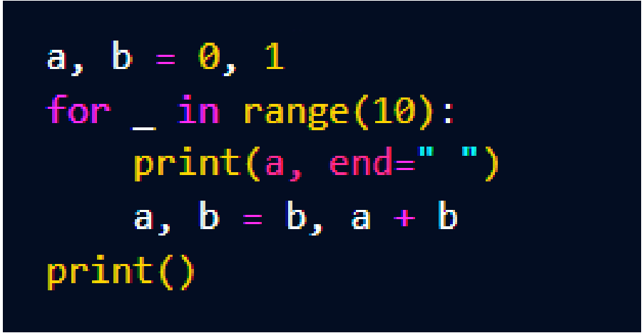

# Reto Java 1

En este ejercicio tipo reto, aplica varias tecnicas en el manejo de cadenas.
Tambien use la clase Random para el generador de contraseñas.

Ademas tenemos una sueccion fubonaccio pasada de python a Java.

a,b = 0, 1
for _ in range(10):
    print(a,end=" ")
    a,b = b,a+b
print()

Este codigo es una sucesion fubonacci la cual su secuencia consiste en que se toma
los dos valores anteriores y se suman y se pone de siguiente.

El codigo es escrito en python asigna los dos valores que comienza esta cadena 0,1
luego con un for limita la cantidad de numeros sumads e imprimidos y prosigue con la secuencia
la cual en python se hace lo que llamanos una asignacion doble, para ello. a sera b, luebo b sera la suma de a y b

Para concluir el proyecto tiene una administrador de dependencias de Maven en su version 4.0

